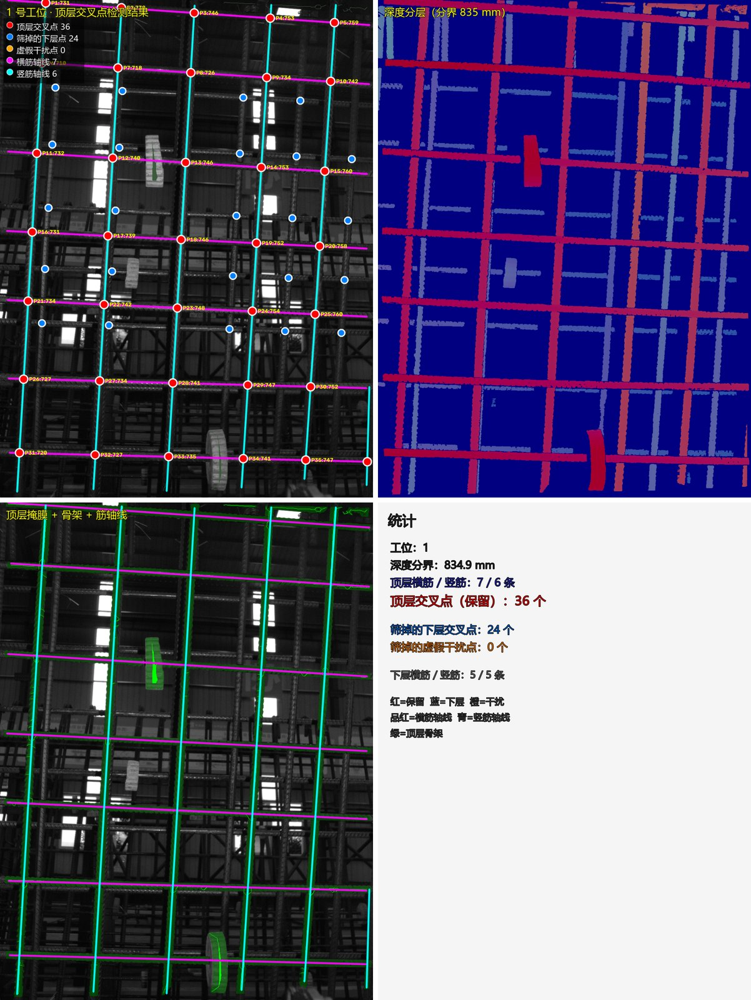

# 课题四 · U 型钢筋笼顶层交叉点检测

**U-shaped rebar cage — top-layer crossing point detection from depth + grayscale vision**

> 用同一场景配对的「深度图 + 灰度图」找出 U 型截面多层钢筋笼**顶层骨架**的钢筋交叉点
> 二维坐标，供自动捆扎机器人使用；同时排除**下层钢筋**与**非钢筋杂物**造成的虚假交叉点。



## 检测效果

任务书提供的 10 组不同工况样本，采用**几何自审计口径**统计（把几何上应当存在的交点全部列出，
再与最终保留点比对，不需要人工标注真值）：

| 指标 | 结果 |
|---|---|
| 几何期望交叉点 | 295 个 |
| 正确保留 | 293 个（**完备率 99.3%**） |
| 误检（多余点） | **0** |
| 逐站保留点数 | 36 / 34 / 28 / 18 / 21 / 24 / 20 / 34 / 37 / 41 |
| 跨平台复现 | Windows 与 Ubuntu 22.04 逐点相同，深度最大偏差 0.000 mm |

2 个未保留点均已逐个查明为**正确剔除**（一处外推竖筋的位置实际没有钢筋，一处压在实心杂物上）。
统计口径与实现见 `src/audit.py`，可用 `python tools/probe/audit_junctions.py` 复现。

## 快速开始

```bash
pip install -r requirements.txt

python app.py --selftest             # 无界面自检：21 项应全部通过
python app.py                        # 打开图形界面（推荐从这里开始）
python run.py --all --stage report   # 命令行批量跑 10 个工位，结果写入 outputs/
```

Ubuntu 22.04 上额外装两项（图形界面运行时 + 中文字体）：

```bash
sudo apt install python3-tk fonts-noto-cjk
```

## 输入与输出

| | 说明 |
|---|---|
| 输入 | 同一场景配对的深度图（`.tif`，单位**米**，无回波处为 `NaN`，有效像素仅 22%~30%）与灰度图（`.png`） |
| 对齐 | 两者尺寸互为转置时，程序自动把深度图逆时针旋转 90°，无需预处理 |
| 输出 | `*_points.csv`（`point_id,x_px,y_px,z_mm`）、`*_points.json`、`*_rejected.json`（下层点/干扰点）、`*_result.png`（四格结果图） |

10 个工位的原始数据在 `任务书数据+代码/`。

## 算法流程

1. **有效像素掩膜** —— 深度有限且大于 0；NaN 视为无回波，背景分割免费得到；
2. **深度分层** —— 在深度直方图上找最宽空段自动定界，近层即顶层（也支持手工指定分界值）；
3. **筋条提取** —— 形态学闭运算 → Zhang-Suen 骨架化 → 去分叉 → `HoughLinesP` →
   按"族"参数化聚类（横筋 `y=ax+b`、竖筋 `x=ay+b`，避免竖筋斜率在 ±90° 处跳变）→ 精拟合出每条筋的轴线；
4. **交叉点三分类** —— 顶层横筋 × 顶层竖筋两两求交，逐点判三条：
   ① 交点深度是否属于顶层，否则判为**下层点**；
   ② 沿两条筋方向的**局部支撑是否连续**，断口或勉强连成的线判为**干扰点**；
   ③ 交点四角是否被整片填满，实心杂物判为**干扰点**；
5. **输出与自审** —— 邻域去重后输出保留点，再用几何期望交点做一次完备性审计，得到漏检数、误检数、完备率。

## 图形界面

`python app.py` 打开后：左栏选样本（数据集工位或任意图像对，带缩略图），
中栏画布（滚轮缩放、左键拖拽平移、左键单击查点），右栏调参并实时看统计与审计结果。

- 四种视图：**原始灰度图 / 增强灰度图（CLAHE）/ 深度伪彩图 / 检测结果**；
- 图上 **红点 = 保留的顶层交叉点，蓝点 = 被剔除的下层点，橙点 = 被剔除的虚假干扰点**，
  两类被剔除的点可分别开关，点选后可读出坐标与深度；
- 「批量分析」一次跑完全部工位，给出每站的**漏检数 / 误检数 / 完备率**并导出 csv 汇总表；
- 「帮助」里有完整的算法说明与操作步骤。

界面导出的坐标文件与结果图，与命令行 `run.py --all --stage report` 的产物**逐字节一致**
（自检里会逐站验证），因此演示和出报告可以用同一个界面完成。

## 目录结构

```
app.py            图形界面入口（python app.py / python app.py --selftest）
app/              Tkinter 界面、应用计算层（runner/render）、无界面自检
run.py            命令行入口（--all --stage preview|detect|report）
src/              imgio 读写与对齐 / enhance 增强 / layers 分层 / detect 检测
                  / viz 可视化 / audit 完备性自审 / pipeline 流程编排
tools/            诊断探针 probe/、跨平台输出比对、Ubuntu 打包脚本
docs/             运行说明、交接文档（实测事实与决策记录）、演示视频脚本
任务书数据+代码/   10 个工位的原始深度图与灰度图
```

## 文档

| 文档 | 内容 |
|---|---|
| `docs/运行说明.md` | 环境要求、数据格式、命令行与应用两套运行方法、参数表、常见问题 |
| `docs/交接文档.md` | 开发过程记录：实测事实 F1–F20、关键决策、进度台账、验证方法 |
| `docs/演示视频脚本.md` | 1 分半演示视频分镜与录屏命令 |

## 说明

- 骨架化使用自实现的 Zhang-Suen 细化，**不依赖 `cv2.ximgproc` 或 `scikit-image`**；
- 含中文的路径统一走 `src/imgio.py::imread_any`（`np.fromfile` + `cv2.imdecode`）读写；
- 数据集与任务书来自课程《智能系统工程训练》，仅用于教学与考核。
